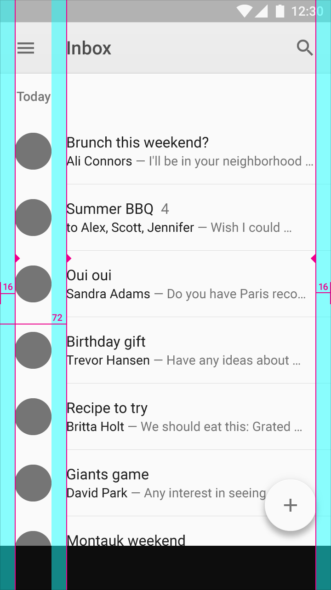

# Design Collaboration Guidelines

As an app developer to provide the best version of the design, you need to define a standard vocabulary between the design team and you.

Designers are more and more integrating design systems as part of their work, and we can benefit from that to layout common ground. Here below we would define the minimum standard requirements to keep consistency and the usuals forgotten piece of app design. Independently of the size of your team, there is already a set of best practices applied by your designer that you can benefit, and other you will need anyway at some point during the development of the app. 

## Style guide - Foundation
These are the basic style that will serve as the foundation of all other components. And avoid mistakes by not using the proper element. Independently if you follow material design, fluent design or any other guidelines, these basics style element will facilitate design adjustment and rebranding.
### Color Palette
A list of all the color used in the app with a name associated.

* https://github.com/SwiftGen/SwiftGen#colors
* https://blog.zeplin.io/asset-catalog-colors-on-xcode-9-c4fdccc0381a
* https://developer.android.com/guide/topics/resources/more-resources.html#Color

### Typography - Fonts
A list of Fonts and Size and when possible complete style including color and format.

### Layout - Sizing and Spacing
Defining base templates that respect ratio and size of most used or more common devices that will be used. And a general rule for padding or margin that you can apply to most of the screen.

## Components - Pattern library - Atoms
Different design systems will have different naming for this, in Atomic Design you will call this Atoms, in others, it's just called Pattern Library, or Components. All these building blocks should be based style guide already provided and will be used to build more complex elements of the user interface like pages and screens.

Commons components  you can find in most applications are:
* Labels
* Inputs
* Buttons

## Interaction Model - Patterns

### Navigation
As today most of the mobile Apps, are single window full-screen design. In collaboration with the designer, it's essential to review a prototype of the navigation that can be but not mandatory with the final design using tools like Marvel or Invision. There is mainly two kind of Navigation to navigate from screen to another.

Stack, You will find this concept under Navigation Stack or Back Stack under the respective platform. You can quickly identify these screen through the fact that they have a Back/Up Button on the top left Corner.
Important: Remind UX and Product Owner that navigation from a notification should keep into account the stack designed to get to the desired screen.

Modal/Dialog, It's a screen that sits on top of the current screen, the user must interact with it before they can return to the previous screen. It should contain text and UI controls focused on a specific task. They inform users about critical information, require users to make decisions, or involve multiple tasks. You could identify them as they have at least a cancel button or close button.
Important: Remind UX and Product Owner a Modal could not be initial screen as they have a dismiss button.

## Empty States
An essential step while design and estimating how complicated a screen is to define the empty states.
### First use
It can be the first time that user uses the app, or it can appear until the user makes the first interaction that generates content.
### User Cleared
Is when the user can clean the content of a screen.
### Error Cases
Is when the App is not able to load the content of the page.

## Loading cases
While reviewing the UI, let know UX and Product Owner which interactions with users will generate load content or perform lengthy data processing operations. Use activity indicators and progress bars to let people know your app isn’t stalled and to give them some idea of how long they’ll be waiting.

A general guideline is to show a loader:
Is when a user interaction blocks the UI, like validating a form through a remote API call.
Is when loading background content could take more than 1 ms

Reference:
* https://tympanus.net/codrops/2013/01/09/designing-for-the-empty-states/
* https://www.invisionapp.com/blog/guide-to-design-systems/
* https://material.io/guidelines/style/color.html#color-color-system
* https://material.io/guidelines/patterns/empty-states.html
* https://uxplanet.org/best-practices-for-modals-overlays-dialog-windows-c00c66cddd8c
